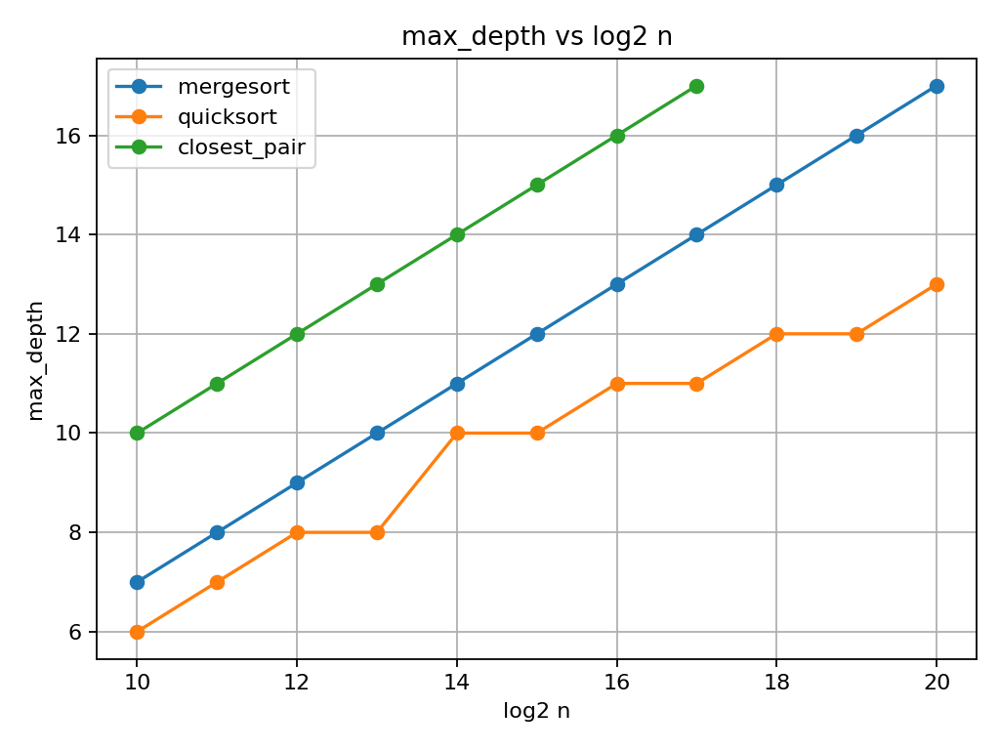
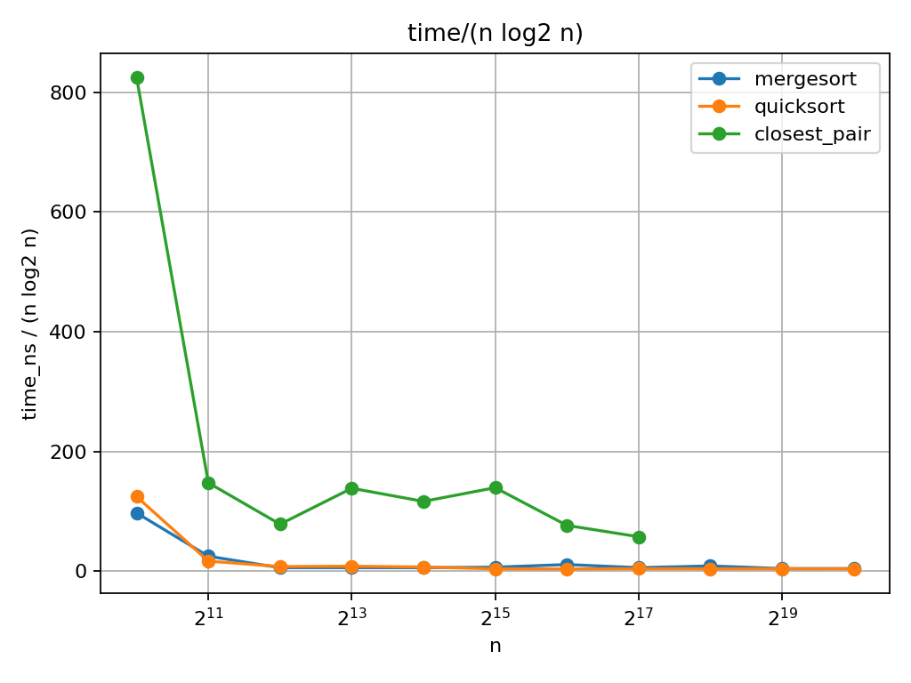
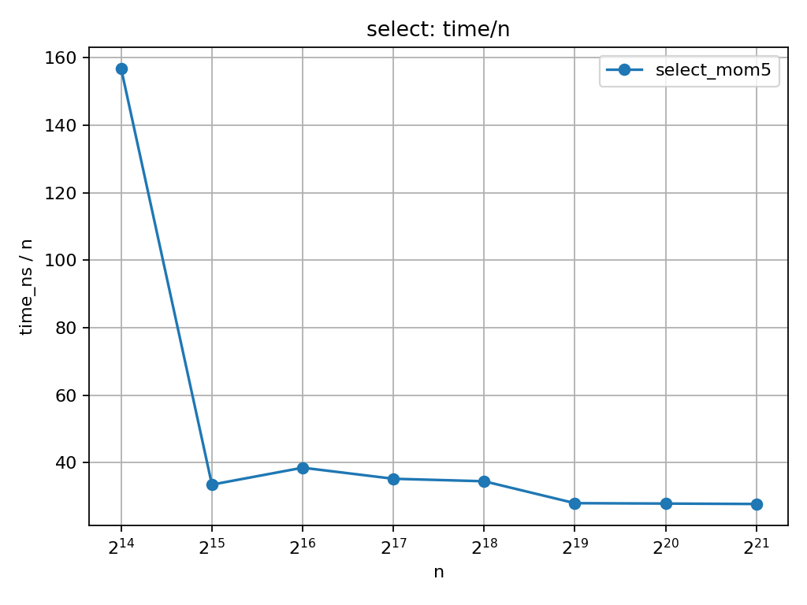

## Divide-and-Conquer Algorithms (Assignment 1)
Course: Design and Analysis of Algorithms • Assignment: 1  
Author: Balakarev Sergej (SE-2404)

### Overview
Four classic divide-and-conquer algorithms on the JVM with safe recursion, low allocations, and lightweight metrics. Theory (Master Theorem, Akra–Bazzi) is validated with measurements.

### Algorithms
- MergeSort — Θ(n log n): linear merge, single reusable buffer, small-n cut-off (insertion sort).
- QuickSort (randomized) — expected Θ(n log n): recurse on smaller side, iterate larger (bounded stack).
- Select (Median-of-Medians, 5) — Θ(n): in-place partition, MoM5 pivot, recurse only where needed.
- Closest Pair (2D) — Θ(n log n): sort by x, maintain y-order, “strip” with constant neighbors.

### Architecture
- Stack safety: JVM has no guaranteed TCO. Smaller-first QuickSort keeps depth ≈ O(log n); MergeSort/Closest are balanced (≈ log2 n). Cut-off reduces depth.
- Allocation control: MergeSort ALLOC=1 (buffer); Closest ALLOC=3 (px, py, buf); QuickSort/Select in-place (ALLOC≈0).

### Metrics (bench.csv)
- Columns: algo, n, time_ns, max_depth, cmp, mov, alloc.
- Notes: swaps = 3 moves; MergeSort mov includes buffer copies; Closest cmp counts only strip comparisons (not initial sorts).

### How to run
- Demo:
    - `java Main`
- Bench (writes `bench.csv`):
    - `java Main bench`

### Plots
1) Depth vs log2 n  
     
   MergeSort/Closest: depth ≈ log2 n. QuickSort: smaller constants (~6→13 for 2^10..2^20).

2) Normalized time (n log n algorithms)  
     
   MergeSort/QuickSort: time/(n·log2 n) → plateau (Θ(n log n)). Closest stabilizes with higher constants.

3) Select: linear behavior  
     
   time/n ≈ constant (Θ(n)); MoM5 has higher constants than “sort-then-pick”.

### Theory → Data (very short)
- MergeSort: T(n)=2T(n/2)+cn → Master Case 2 → Θ(n log n). Matches normalized plateau; depth ~ log2 n.
- QuickSort: randomized E[T(n)]=Θ(n log n); smaller-first → stack O(log n). Matches plateau and shallow depth.
- Select (MoM5): T(n)≤T(n/5)+T(7n/10)+cn → Akra–Bazzi intuition → Θ(n). Matches time/n ≈ const.
- Closest Pair: T(n)=2T(n/2)+cn → Master Case 2 → Θ(n log n). Matches plateau; depth ~ log2 n.

### Summary
Theory and measurements align:
- MergeSort & Closest: Θ(n log n), logarithmic depth.
- QuickSort: expected Θ(n log n), bounded stack via smaller-first recursion.
- Select (MoM5): Θ(n) with larger constants.